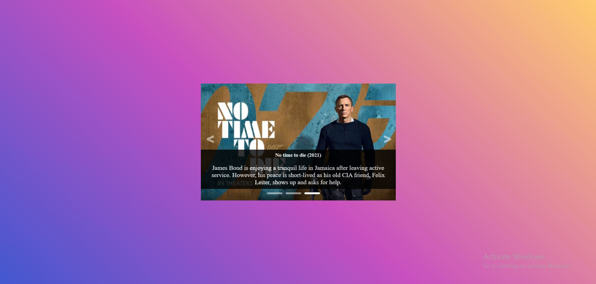

# JS-Carousel
 Carousel build only using CSS and Javascript.  
 Checkout carousel live [click here](https://js-carousel-k.netlify.app/).  
   
   
 Features -  
 1. Automated slide Transitions
 2. Slide Title and Paragraph  
 3. Showing the user which slide they're on!
